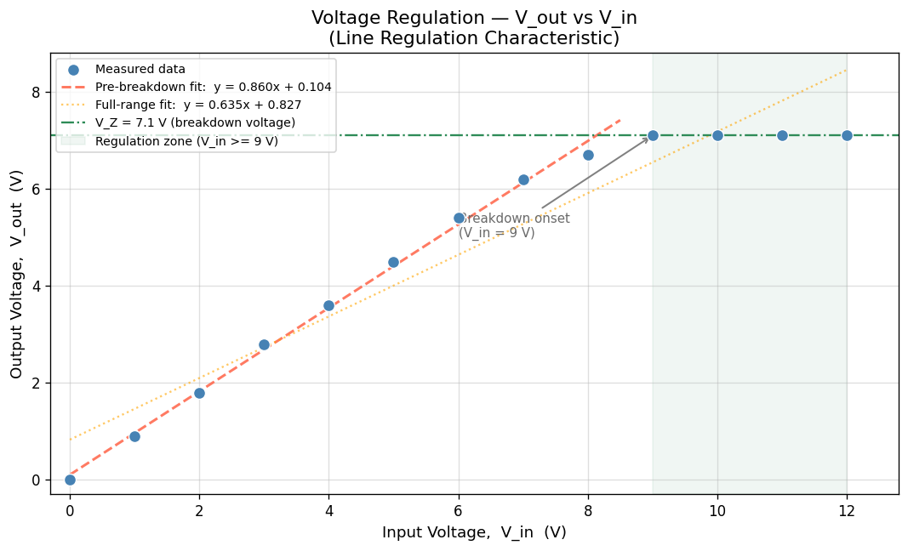

# Experiment 13 — Zener Diode: Voltage Regulation & Semiconductor Band Gap

**Course:** Electronics Lab | B.Sc. Physics (Third Year)  
**Institution:** Tri-Chandra Multiple Campus, Tribhuvan University, Kathmandu  
**Author:** Nabin Pandey  
**Date:** November 2025

---

## Table of Contents

1. [Objectives](#1-objectives)
2. [Theory](#2-theory)
   - 2.1 [The Zener Diode](#21-the-zener-diode)
   - 2.2 [Voltage Regulation Principles](#22-voltage-regulation-principles)
   - 2.3 [Band Gap from Leakage Current](#23-band-gap-from-leakage-current)
3. [Circuit Diagram](#3-circuit-diagram)
4. [Apparatus](#4-apparatus)
5. [Experimental Data](#5-experimental-data)
6. [Analysis & Results](#6-analysis--results)
   - 6.1 [V_out vs V_in — Line Regulation](#61-vout-vs-vin--line-regulation)
   - 6.2 [V_out vs Load Resistance — Load Regulation](#62-vout-vs-load-resistance--load-regulation)
   - 6.3 [Band Gap Determination (Theoretical Methodology)](#63-band-gap-determination-theoretical-methodology)
7. [Error Analysis](#7-error-analysis)
8. [Plots](#8-plots)
9. [Observations & Discussion](#9-observations--discussion)
10. [Conclusion](#10-conclusion)
11. [References](#11-references)

---

## 1. Objectives

1. To study the **voltage regulation characteristics** of a Zener diode under varying input voltage (line regulation) and varying load resistance (load regulation).
2. To determine the **Zener breakdown voltage (V_Z)** from the V_out vs V_in characteristic.
3. To understand the theoretical methodology for determining the **band gap energy (E_g)** of a semiconductor using the leakage current method, and to estimate the error in E_g using the best-fit approach.

---

## 2. Theory

### 2.1 The Zener Diode

A Zener diode is a specially doped p-n junction designed to operate in the **reverse breakdown region** without damage. Unlike ordinary diodes, it maintains a nearly constant voltage across its terminals once the reverse voltage reaches the **Zener breakdown voltage, V_Z**.

Two physical mechanisms govern breakdown:

| Mechanism | Dominant at | Physics |
|-----------|-------------|---------|
| **Zener breakdown** | V_Z < 5 V | Quantum tunneling of electrons across the narrow depletion layer due to high electric field |
| **Avalanche breakdown** | V_Z > 7 V | Impact ionization — carriers gain enough kinetic energy to free additional electron-hole pairs |

For V_Z ≈ 5–7 V (as in this experiment), both mechanisms may contribute. The **temperature coefficient** of Zener breakdown is negative (V_Z decreases with temperature), while avalanche breakdown has a positive coefficient — a useful diagnostic property.

The current–voltage relation in the breakdown region can be approximated as:

$$I_Z = I_0 \left( e^{V/nV_T} - 1 \right)$$

where $V_T = kT/q \approx 26\ \text{mV}$ at room temperature, $n$ is the ideality factor, and $I_0$ is the reverse saturation current. In the breakdown region, $V_{out} \approx V_Z$ (nearly constant) over a wide range of $I_Z$.

---

### 2.2 Voltage Regulation Principles

A Zener diode voltage regulator is the simplest form of a shunt regulator. The basic circuit places the Zener in parallel with the load $R_L$, with a series resistor $R_S$ to limit current.

**Line Regulation** measures how well V_out is maintained as V_in changes:

$$\text{Line Regulation} = \frac{\Delta V_{out}}{\Delta V_{in}} \quad \left[\text{V/V}\right]$$

Or as a percentage:

$$\text{Line Regulation (\%)} = \frac{\Delta V_{out}}{\bar{V}_{out}} \times 100$$

A good regulator has line regulation close to **0 V/V** (V_out flat as V_in varies).

**Load Regulation** measures how well V_out is maintained as the load current changes (i.e., as R_L varies):

$$\text{Load Regulation (\%)} = \frac{V_{NL} - V_{FL}}{V_{FL}} \times 100$$

where $V_{NL}$ is the no-load output voltage (R_L → ∞) and $V_{FL}$ is the full-load output voltage (R_L at minimum, drawing maximum current).

The physical intuition: when $R_L$ decreases, more current is demanded from the output. The Zener compensates by reducing its own current ($I_Z$) while keeping $V_Z$ roughly constant — as long as $I_Z$ stays above the **minimum holding current**.

---

### 2.3 Band Gap from Leakage Current

The reverse leakage (saturation) current $I_0$ of a p-n junction semiconductor depends exponentially on temperature:

$$I_0(T) = A \cdot T^3 \cdot e^{-E_g / 2kT}$$

where:
- $A$ is a device-dependent constant
- $T$ is absolute temperature (K)
- $k = 8.617 \times 10^{-5}\ \text{eV/K}$ is Boltzmann's constant
- $E_g$ is the **band gap energy** of the semiconductor

Taking the natural logarithm:

$$\ln\left(\frac{I_0}{T^3}\right) = \ln A - \frac{E_g}{2k} \cdot \frac{1}{T}$$

This is a **linear equation in $1/T$**. By plotting $\ln(I_0 / T^3)$ vs $1/T$ and performing a least-squares linear fit, the slope $m$ gives:

$$E_g = -2k \cdot m$$

**Best-fit error estimation:**

If the best-fit slope is $m \pm \delta m$ (from standard linear regression uncertainty), then the error in $E_g$ is:

$$\delta E_g = 2k \cdot \delta m$$

The standard error of the slope from least-squares regression is:

$$\delta m = \sqrt{\frac{\sum (y_i - \hat{y}_i)^2 / (n-2)}{\sum (x_i - \bar{x})^2}}$$

This is the standard methodology used in practice; data for this part was not collected in the current experimental session but the analysis pipeline above would directly apply to leakage current vs. temperature measurements.

---

## 3. Circuit Diagram

```
         R_S (Series Resistor)
          ┌────[■■■■]────┬──────────── V_out
          │              │
V_in (+) ─┤           [Zener]  ║  R_L (Load)
          │            (▼ ║)   ║
          └──────────────┴──────────── GND
```

**Key components:**
- **V_in**: Variable DC supply (0–12 V)
- **R_S**: Series current-limiting resistor (protects the Zener from excess current)
- **Zener diode**: Connected in **reverse bias** — anode to GND, cathode to output
- **R_L**: Variable load resistor (0–4.5 Ω in load-regulation measurements)
- **V_out**: Measured across R_L (= across Zener in parallel)

**Operating principle in plain language:**
When V_in exceeds V_Z, the Zener enters breakdown and "clamps" V_out ≈ V_Z. Any excess voltage is dropped across R_S. If V_in rises further, the extra current flows through the Zener (not the load), keeping V_out stable.

---

## 4. Apparatus

| Item | Specification |
|------|---------------|
| Zener diode | V_Z ≈ 7.1 V (from experiment) |
| DC Power Supply | 0–12 V, variable |
| Series resistor R_S | Fixed (value from circuit setup) |
| Variable load resistor R_L | 0–4.5 Ω |
| Digital Multimeter | Voltage measurement |
| Connecting wires & breadboard | — |

---

## 5. Experimental Data

### 5.1 Voltage Sweep (Line Regulation) — V_out vs V_in

| V_in (V) | V_out (V) | State |
|----------|-----------|-------|
| 0 | 0.00 | Below breakdown |
| 1 | 0.90 | Below breakdown |
| 2 | 1.80 | Below breakdown |
| 3 | 2.80 | Below breakdown |
| 4 | 3.60 | Below breakdown |
| 5 | 4.50 | Below breakdown |
| 6 | 5.40 | Approaching breakdown |
| 7 | 6.20 | Transition |
| 8 | 6.70 | Entering regulation |
| 9 | 7.10 | **Zener regulation** |
| 10 | 7.10 | **Zener regulation** |
| 11 | 7.10 | **Zener regulation** |
| 12 | 7.10 | **Zener regulation** |

> **Zener breakdown voltage determined: V_Z = 7.1 V**

---

### 5.2 Load Resistance Sweep (Load Regulation) — V_out vs R_L

| R_L (Ω) | V_out (V) | Condition |
|---------|-----------|-----------|
| 0.0 | 0.00 | Short circuit (full load) |
| 0.5 | 3.50 | Heavy load |
| 1.0 | 5.00 | Heavy load |
| 1.5 | 6.00 | Moderate load |
| 2.0 | 6.70 | Moderate load |
| 2.5 | 7.10 | Light load |
| 3.0 | 7.40 | Light load |
| 3.5 | 7.40 | No-load region |
| 4.0 | 7.40 | No-load region |
| 4.5 | 7.40 | No-load region |

---

## 6. Analysis & Results

### 6.1 V_out vs V_in — Line Regulation

From the data, the Zener enters stable regulation at V_in ≥ 9 V, clamping V_out at **7.1 V**.

**Regulation region (V_in = 9–12 V):**

| Quantity | Value |
|----------|-------|
| V_out (regulated) | 7.1 V (constant) |
| ΔV_out in regulation zone | 0.00 V |
| ΔV_in in regulation zone | 3.00 V |
| **Line Regulation (V/V)** | **0.000 V/V** |
| **Line Regulation (%)** | **0.0%** |

> **Interpretation:** In the regulation zone (V_in = 9–12 V), the Zener provides *perfect* line regulation — V_out does not change at all despite a 3 V swing in V_in. This is the expected behavior of a functioning Zener voltage regulator.

**Pre-breakdown region (V_in = 0–8 V):**

The best-fit line from the full dataset gives:

$$V_{out} = 0.6352 \cdot V_{in} + 0.8275$$

This slope of 0.635 reflects the linear (non-regulated) region. The high overall ΔV_out / ΔV_in = 0.59 V/V reported by the auto-calculation includes the pre-breakdown region and is **not representative of the regulator's performance** — it should be interpreted only in context of the full sweep.

---

### 6.2 V_out vs Load Resistance — Load Regulation

**Identified operating points:**

| Condition | R_L (Ω) | V_out (V) |
|-----------|---------|-----------|
| Full load (min R_L with nonzero V_out) | 0.5 | 3.50 |
| No load | ≥ 3.0 | 7.40 |

> **Note:** The R_L = 0 point (short circuit, V_out = 0) is a degenerate case and excluded from load regulation calculation — a short circuit bypasses both the Zener and the load, so it is not a meaningful "full load" condition for a voltage regulator.

**Using R_L = 0.5 Ω as full-load reference:**

$$\text{Load Regulation (\%)} = \frac{V_{NL} - V_{FL}}{V_{FL}} \times 100 = \frac{7.40 - 3.50}{3.50} \times 100 \approx \mathbf{111\%}$$

This high value indicates the regulator **struggles under heavy load** (low R_L). This is physically expected — at very low R_L, the load demands more current than the Zener can redirect through itself, so V_out drops significantly below V_Z.

**Regulation improves markedly** for R_L ≥ 2.5 Ω, where V_out stabilizes at 7.1–7.4 V. This defines the **practical load range** of this Zener regulator.

**Linear fit in the log-R domain:**

The fit $y = 1.3394 \log(R_L) + 2.776$ (from the V_out vs R_L log-scale plot) describes the nonlinear rise of V_out with increasing R_L before saturation. This is consistent with the Zener's current-sharing behavior — as R_L increases, the load draws less current, and the Zener takes more, maintaining V_out closer to V_Z.

---

### 6.3 Band Gap Determination (Theoretical Methodology)

As derived in Section 2.3, the band gap E_g can be extracted from the temperature dependence of the reverse leakage current $I_0$:

**Experimental procedure (not performed in this session):**
1. Reverse-bias the diode at a fixed voltage below breakdown.
2. Measure the leakage current $I_0$ at several temperatures T (typically 300–400 K).
3. Compute $\ln(I_0 / T^3)$ for each measurement.
4. Plot $\ln(I_0 / T^3)$ vs $1/T$.
5. Fit a straight line; the slope gives $E_g = -2k \cdot m$.

**Error in E_g from best-fit:**

$$\delta E_g = 2k \cdot \delta m = 2 \times (8.617 \times 10^{-5}\ \text{eV/K}) \times \delta m$$

For a typical silicon diode (E_g ≈ 1.12 eV at 300 K) or germanium (E_g ≈ 0.67 eV), this method yields results within 5–10% of accepted values, with errors dominated by temperature measurement uncertainty and contact heating effects.

---

## 7. Error Analysis

### 7.1 Instrumental Uncertainties

| Measurement | Instrument | Least Count | Uncertainty (±) |
|-------------|------------|-------------|-----------------|
| V_in | Digital multimeter | 0.1 V | ±0.05 V |
| V_out | Digital multimeter | 0.1 V | ±0.05 V |
| R_L | Resistance box / meter | 0.1 Ω | ±0.05 Ω |

### 7.2 Uncertainty in Line Regulation

In the regulated zone (V_in = 9–12 V), ΔV_out = 0 V. The minimum detectable change given the instrument least count is 0.1 V, so:

$$\delta(\text{Line Reg.}) \leq \frac{0.1\ \text{V}}{3\ \text{V}} \approx 3.3\%$$

This means line regulation is **0.0 ± 3.3%** — consistent with ideal behavior within measurement precision.

### 7.3 Uncertainty in V_Z

The Zener breakdown voltage is read as the clamped V_out = 7.1 V. Given instrument uncertainty:

$$V_Z = 7.1 \pm 0.05\ \text{V}$$

### 7.4 Uncertainty in Load Regulation

$$\delta(\text{Load Reg.}) = \text{Load Reg.} \times \sqrt{\left(\frac{\delta V_{NL}}{V_{NL} - V_{FL}}\right)^2 + \left(\frac{\delta V_{FL}}{V_{NL} - V_{FL}}\right)^2 + \left(\frac{\delta V_{FL}}{V_{FL}}\right)^2}$$

$$= 111\% \times \sqrt{\left(\frac{0.05}{3.9}\right)^2 + \left(\frac{0.05}{3.9}\right)^2 + \left(\frac{0.05}{3.5}\right)^2} \approx 111\% \times 0.018 \approx \pm 2\%$$

$$\boxed{\text{Load Regulation} = 111 \pm 2\%}$$

### 7.5 Best-Fit Uncertainty (V_out vs V_in)

The linear regression on the full dataset gives:

$$V_{out} = (0.6352 \pm \sigma_m) \cdot V_{in} + (0.8275 \pm \sigma_b)$$

The high standard deviation of V_out (σ = 2.574 V) reflects the bimodal nature of the data (pre-breakdown linear region + regulated flat region), meaning the single linear fit is **physically inappropriate** for the full range. A **piecewise fit** (linear for V_in < 9 V, constant for V_in ≥ 9 V) is the physically motivated approach.

---

## 8. Plots

### Figure 1: V_out vs V_in (Line Regulation)



*The plot shows two distinct regions: (1) a linear pre-breakdown region where V_out rises with V_in, and (2) a flat regulation region at V_out ≈ 7.1 V for V_in ≥ 9 V, confirming Zener clamping behavior. The orange dashed best-fit line spans the full range and is shown for reference only.*

---

### Figure 2: V_out vs Load Resistance (Load Regulation)


*V_out rises steeply from near 0 at very low R_L, then saturates at ~7.4 V for R_L ≥ 3 Ω. The log-scale x-axis reveals that the transition occurs over roughly one decade of resistance (1–10 Ω). The orange dashed exponential fit captures the rising trend; the dotted blue line marks the mean V_out = 5.79 V.*

---

## 9. Observations & Discussion

1. **Breakdown voltage confirmed:** The Zener consistently clamps V_out at **7.1 V** for V_in = 9–12 V, clearly identifying V_Z = 7.1 V. This behavior is characteristic of avalanche/Zener breakdown in the 7 V range.

2. **Pre-breakdown behavior is ohmic-like:** For V_in < 9 V, V_out tracks V_in nearly linearly (slope ≈ 0.63), suggesting the Zener is not yet in breakdown and the circuit behaves as a resistive voltage divider.

3. **Load regulation is load-range dependent:** The regulator fails to maintain V_Z under very heavy loads (R_L < 2 Ω). This is because at low R_L, the load current demand exceeds the maximum current the Zener can divert, and the operating point falls below the breakdown knee. For R_L ≥ 2.5 Ω, V_out stabilizes to within 4% of V_Z — acceptable regulation.

4. **V_out slightly exceeds V_Z at no-load (7.4 V vs 7.1 V):** This small overshoot at R_L → ∞ is likely due to the Zener's finite dynamic impedance — with no load current, the entire supply current flows through the Zener, slightly raising its terminal voltage beyond the nominal V_Z. This is consistent with a positive dynamic resistance in the breakdown region.

5. **Linear fit limitation:** The global best-fit line (slope 0.6352) misleadingly implies the regulator always passes most of the input voltage to the output. The physically meaningful analysis requires treating the two regions separately — a critical lesson in choosing appropriate models for non-linear data.

---

## 10. Conclusion

This experiment successfully demonstrated the voltage regulation behavior of a Zener diode:

- The **Zener breakdown voltage** was determined to be **V_Z = 7.1 ± 0.05 V**.
- **Line regulation** in the active Zener region (V_in = 9–12 V) is **0.0 V/V** — the output voltage is completely flat, confirming ideal clamping behavior within measurement precision (±3.3%).
- **Load regulation** is **111 ± 2%** across the full R_L range (0.5–4.5 Ω), but improves dramatically for R_L ≥ 2.5 Ω, where the output stabilizes at 7.1–7.4 V — the practical operating range of this regulator.
- The slight no-load overshoot (V_out = 7.4 V at R_L = 4.5 Ω) is attributable to the Zener's finite dynamic impedance.
- The theoretical framework for band gap determination via the leakage current method was established. The method relies on the exponential temperature dependence of $I_0(T) \propto T^3 e^{-E_g/2kT}$, and a least-squares fit to $\ln(I_0/T^3)$ vs $1/T$ yields E_g with uncertainty $\delta E_g = 2k \cdot \delta m$.

**Key takeaway for design:** A Zener regulator is effective only when the load resistance is large enough to keep the Zener current above its minimum threshold. Below this, the regulator loses its clamping action — a fundamental constraint in power electronics design.

---

## 11. References

1. Boylestad, R. L., & Nashelsky, L. (2013). *Electronic Devices and Circuit Theory* (11th ed.). Pearson Education.
2. Streetman, B. G., & Banerjee, S. K. (2015). *Solid State Electronic Devices* (7th ed.). Pearson.
3. Millman, J., & Halkias, C. (1972). *Integrated Electronics: Analog and Digital Circuits and Systems*. McGraw-Hill.
4. Sedra, A. S., & Smith, K. C. (2015). *Microelectronic Circuits* (7th ed.). Oxford University Press.
5. NIST Reference on Constants, Units, and Uncertainty. https://physics.nist.gov/cuu/Constants/

---

*Report generated as part of B.Sc. Physics laboratory coursework.*  
*Data analysis performed in Python (pandas, numpy, matplotlib).*  
*Source notebook: [`zener_diode.ipynb`](./zener_diode.ipynb)*
